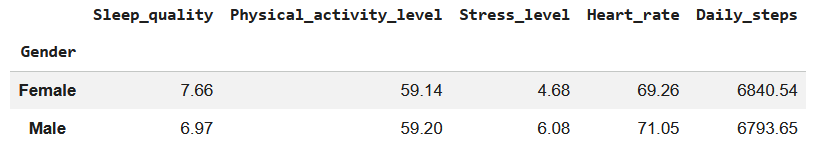
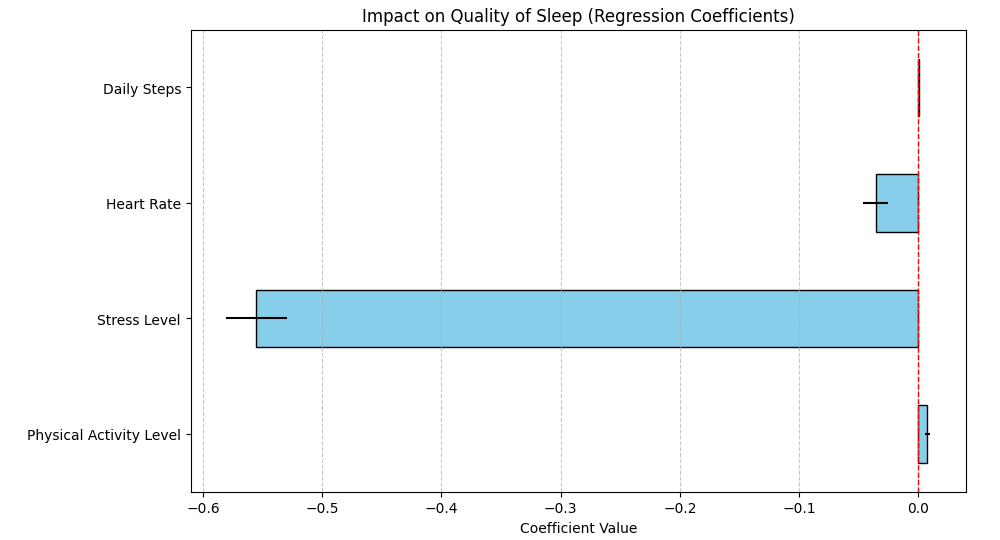

# Sleep Quality Analysis: A Regression Approach

This project investigates:
1. The differences in sleep quality and various lifestyle factors (stress level, heart rate, physical activity, and daily steps) **between males and females**.
2. The relationship between sleep quality and these lifestyle factors using **Multiple Linear Regression**.

## Project Overview
The goal of this analysis is to determine the statistical significance of daily habits on sleep quality. The project includes:
* **Descriptive Statistics:** Comparing health metrics across genders.
* **Predictive Modeling:** Building a linear regression model to quantify impacts.
* **Inference:** Using $p$-values to evaluate the importance of each predictor.

## Dataset
The dataset was obtained from the Kaggle **"Sleep Health and Lifestyle Dataset."**
* **Source:** [Kaggle Dataset Link](https://www.kaggle.com/datasets/uom190346a/sleep-health-and-lifestyle-dataset)

## Variables 
* **Sleep Quality:** A subjective rating of sleep quality, ranging from 1 to 10.
* **Physical Activity Level (minutes/day):** The number of minutes an individual engages in physical activity daily.
* **Stress Level (scale: 1–10):** A subjective rating of the stress experienced by the individual.
* **Heart Rate (bpm):** The resting heart rate in beats per minute.

## Key Findings

### Gender Comparison Summary
Based on the descriptive analysis, females in this dataset exhibit better sleep quality on average. Their stress levels and heart rates are lower, indicating a more favorable health status. Additionally, their physical activity metrics (specifically daily steps) are slightly higher compared to males.

### Regression Analysis
Using **Ordinary Least Squares (OLS)** regression, the following relationships were identified:
* **Stress Level:** Shows a strong negative correlation with sleep quality (Coefficient: -0.55, $p < 0.001$).
* **Heart Rate:** Higher heart rates are significantly associated with lower sleep quality ($p = 0.001$).
* **Physical Activity:** Demonstrates a significant positive relationship with sleep quality ($p = 0.003$).
* **Daily Steps:** Interestingly, daily steps were **not** a statistically significant predictor in this model ($p = 0.143$), suggesting that the *intensity* of activity (Physical Activity Level) may be more influential than raw step volume.

### Visualizing Impacts
The **Coefficient Plot** below visualizes the estimated effects of each variable. This allows for a quick comparison of which factors most heavily influence the model's predictions.

## Tech Stack
* **Python**
* **Pandas & NumPy:** Data manipulation and descriptive grouping.
* **Scikit-Learn:** Machine learning implementation (Linear Regression).
* **Statsmodels:** Detailed statistical summaries and $p$-value analysis.

## Model Performance
The regression model achieved an **R-squared of 0.85**, indicating that approximately **85% of the variance** in sleep quality can be explained by the included predictors. 

The results confirm that while stress level, heart rate, and physical activity are statistically significant drivers of sleep quality, daily steps do not provide additional explanatory power when the other variables are already accounted for.
